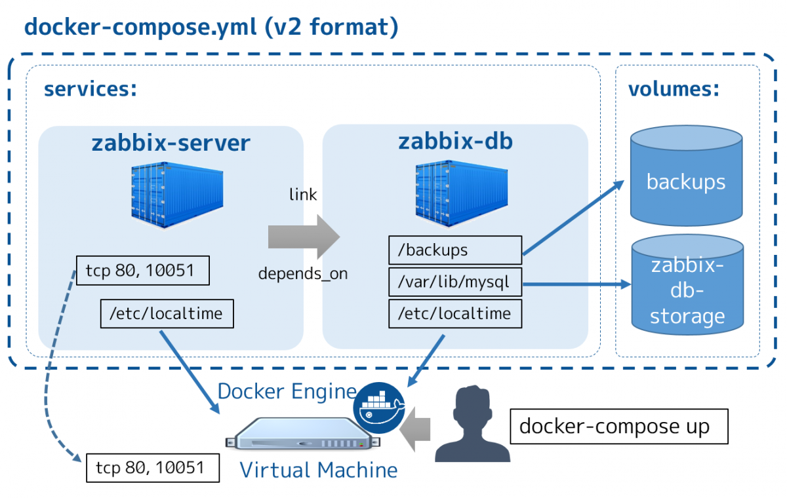

  

### Update Record

* 2019.03.20 Dockerfile update ENV  `/etc/localtime /etc/timezone LANG C.UTF-8`  
* 2019.02.22 Dockerfile add  `usermod -u 1000 www-data`  
* 2019.01.11 add install `unzip、crontab`  

### Source Code

* [http://jp2.php.net/distributions/php-7.2.13.tar.gz](http://jp2.php.net/distributions/php-7.2.13.tar.gz)
* [http://oss.tinywan.com/uploads/php-7.2.13.tar.gz](http://oss.tinywan.com/uploads/php-7.2.13.tar.gz)
* [https://github.com/phpredis/phpredis/archive/4.2.0.tar.gz](https://github.com/phpredis/phpredis/archive/4.2.0.tar.gz)

### Build Docker Images

```
$ docker build --rm --no-cache -t tinywan/lnmp:latest .
$ docker build --rm --no-cache -t tinywan/lnmp:php7.2.13-v2 .
```

* `--no-cache` 默认`false`。设置该选项，将不使用Build Cache构建镜像
* `--rm`，默认`--rm=true`，即整个构建过程成功后删除中间环节的容器
* `--tag, -t`，镜像的名字及`tag`

#### Login Docker Hub
```
$ docker login --username=tinywan --password=tinywan123
```

#### Cat Images

```
$ docker images
REPOSITORY               TAG                 IMAGE ID            CREATED             SIZE
tinywan/lnmp             latest              e96dbe0fbbfb        43 minutes ago      789MB
```

#### Image Tag 
```
$ docker images
$ docker tag e96dbe0fbbfb tinywan/lnmp:php7.2.13-v3
```

#### Image Push 
```
$ docker push tinywan/lnmp:php7.2.13-v3
```

#### Run Container

```
$ docker run -it -d --name lnmp-php7.2 tinywan/lnmp /bin/bash
```

#### Cat Running Container

```
$ docker ps
CONTAINER ID   IMAGE                      COMMAND               PORTS    NAMES
f31bb449fd8b   tinywan/lnmp:php7.2.13-v3  "/bin/bash"  9000/tcp  lnmp-php7.2
```

#### Input Container

```
$ docker attach f31bb449fd8b
root@f31bb449fd8b:/# cat /etc/issue
Ubuntu 18.04.1 LTS \n \l
```

### baseimage 

```
docker pull tinywan/baseimage
docker run -it tinywan/baseimage /bin/bash
```

### PHP Version

```
# /usr/local/php/bin/php -v
PHP 7.3.0 (cli) (built: Dec 18 2018 11:05:01) ( NTS )
Copyright (c) 1997-2018 The PHP Group
Zend Engine v3.3.0-dev, Copyright (c) 1998-2018 Zend Technologies
```

#### Has Install  PHP Module
```
# php -m
[PHP Modules]
bcmath
bz2
calendar
Core
ctype
curl
date
dom
exif
fileinfo
filter
ftp
gd
gettext
hash
iconv
imap
json
libxml
mbstring
mysqli
mysqlnd
openssl
pcntl
pcre
PDO
pdo_mysql
pdo_sqlite
Phar
posix
Reflection
session
SimpleXML
soap
sockets
SPL
sqlite3
standard
sysvsem
sysvshm
tokenizer
xml
xmlreader
xmlrpc
xmlwriter
xsl
zip
zlib

[Zend Modules]

```
#### PHP Configure
```
/usr/local/php/etc/
```

### ERROR

*   Error01 `/bin/sh: 1: source: not found`
    > `RUN ["/bin/bash", "-c", "source ~/.profile"]` replace `RUN source ~/.profile `
*   Error03 `https://registry-1.docker.io/v2/: net/http: request .. Client.Timeout`  
    >  [https://mirrors.ustc.edu.cn/help/dockerhub.html](https://mirrors.ustc.edu.cn/help/dockerhub.html)
*   MAC OS `Permissions on the Docker host;` 
    > `usermod -G staff www-data`
### Help

*   [write in shared volumes docker](https://stackoverflow.com/questions/29245216/write-in-shared-volumes-docker)
*   [bind-mount或者COPY时需要注意 用户、文件权限 的问题](https://segmentfault.com/a/1190000015233229)
